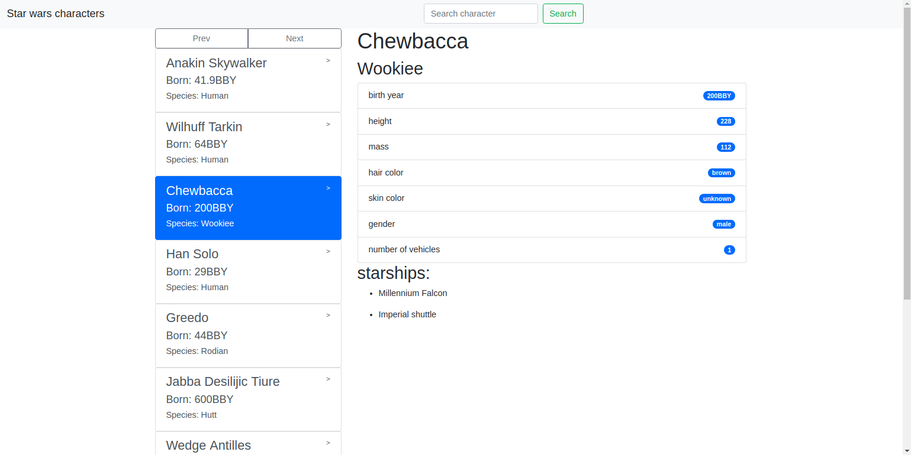

# Star Wars Character Search

This project is a Single Page Application allowing you to search through all of the Star Wars characters using [The Star Wars API](https://swapi.co/).

## Technologies used
* JavaScript
* TypeScript
* Angular 6
* RxJS
* Lodash
* Bootstrap 4
* REST
* Surge
* TSLint

## Demo

## Functionality

The user may search the character by its name.

10 characters are being loaded on one page. To show previous or next page, another API request to the API is being sent.

[PREVIEW MY APP](http://starwars-character-search.surge.sh/)